# Partie 1 - Dictionnaire
## Question 1

```sql
SELECT * FROM DICTIONARY;
```

La table DICTIONARY est composée de 2 colonnes : 

- "TABLE_NAME" et
- "COMMENTS" 

Cette table contient 994 lignes au total.

## Question 2

```sql
SELECT * FROM dba_users;
```
 
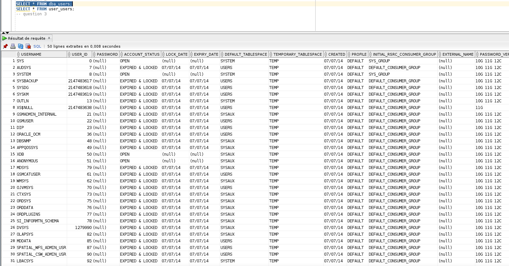


```sql
SELECT * FROM user_users;
```
 
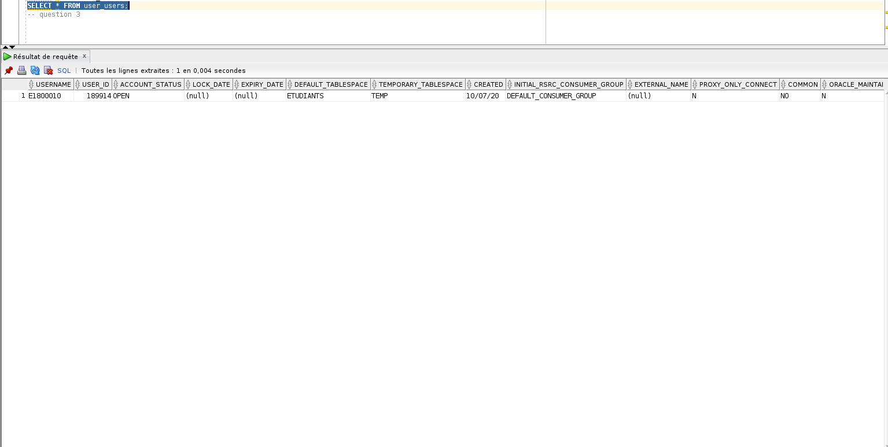

## Question 3

```sql
SELECT * FROM dba_objects a, dba_tables b, dba_indexes c 
WHERE a.owner=b.owner AND b.owner=c.owner AND c.owner='KESSLER_BDD';
```
 
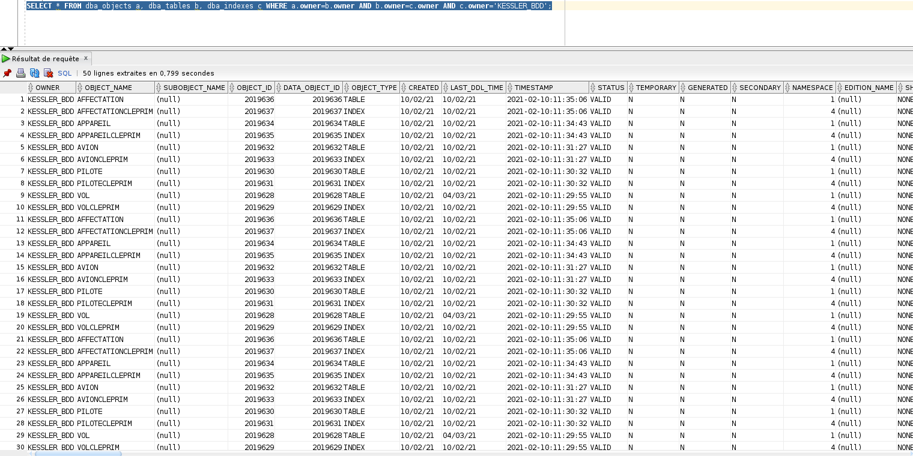

## Question 4

```sql
SELECT * FROM V$INSTANCE;
```

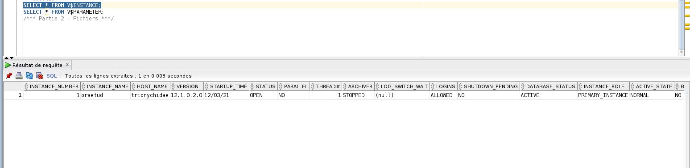

```sql
SELECT * FROM V$PARAMETER;
```

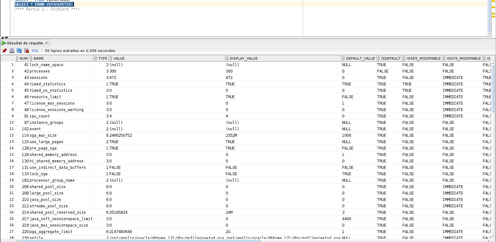

# Partie 2 - Fichiers
## Question 1 - fichiers de données

```sql
SELECT * FROM V$DBFILE;
```

Les fichiers sont listés dans la colonne `NAME`.


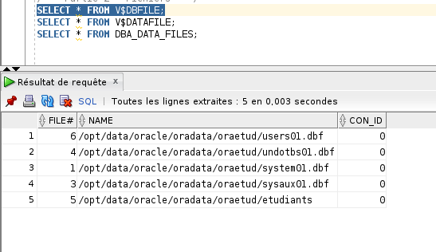

On peut voir leurs date de création via la colonne `CREATION_TIME`

```sql
SELECT * FROM V$DATAFILE;
```

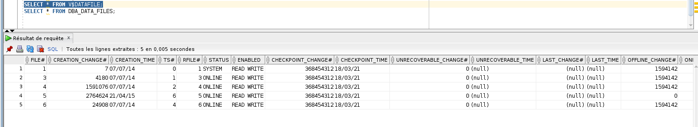

Nous pouvons voir la taille de ces fichiers grâces à la colonne `BYTES`
Nous pouvons aussi voir via la colonne `CHECKLPONT_CHANGE#` la "date" (compteur SCN - System Change Number) du dernier checkpoint.

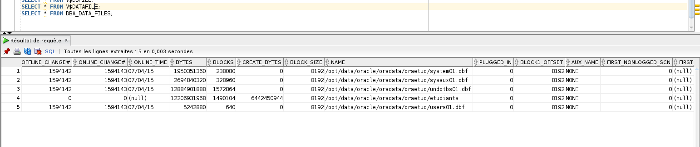

Nous pouvons voir grâce à la commande suivante à quels tablespaces ces fichiers sont associés.
 
```sql
SELECT * FROM DBA_DATA_FILES;
```

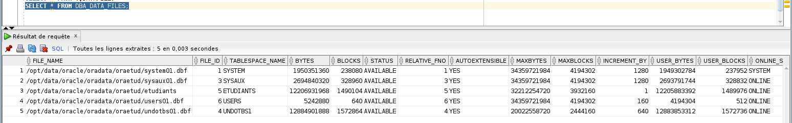

## Question 2 - fichiers de reprise

Les fichiers de reprises sont listés dans la colonne `MEMBER`.

```sql
SELECT * FROM V$LOGFILE;
```

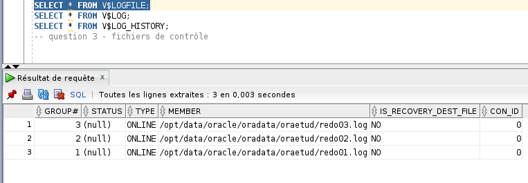

La taille de chaque se trouve dans la colonne `BYTES`.

Le fichier de reprise en cours est marqué `CURRENT` dans la colonne `STATUS`.

Les fichiers ne sont pas multiplexés.
La base n'est pas en `ARCHIVELOG`, c'est marqué `NO` dans la colonne `ARCHIVE`.

```sql
SELECT * FROM V$LOG;
```

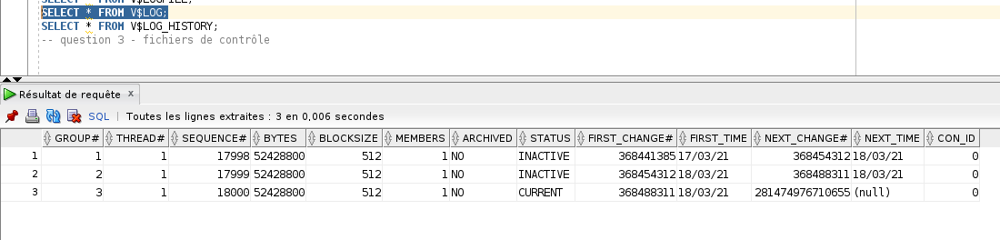

`SELECT * FROM V$LOG_HISTORY;`

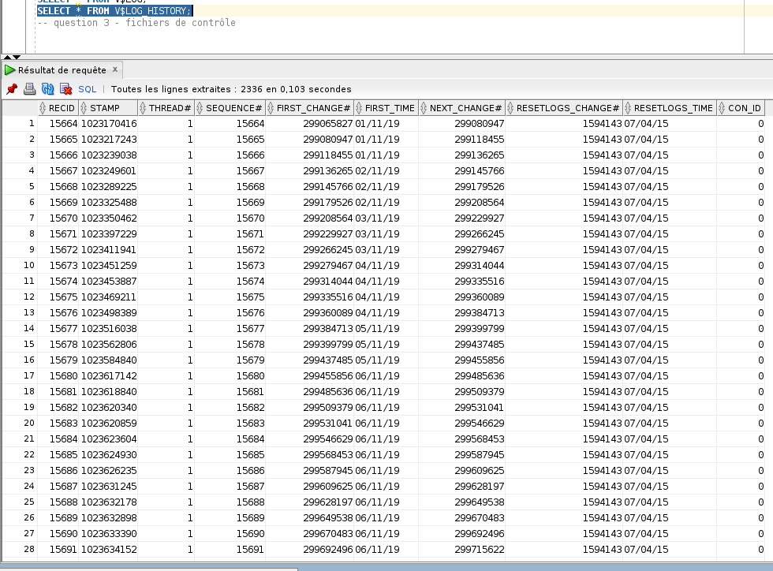

## Question 3 - fichiers de contrôle

Les noms des fichiers se trouvent dans la colonne `MEMBER` et leur taille dans les colonnes `BLOCK_SIZE` et `FILE_SIZE_BLKS`.

```sql
SELECT * FROM V$CONTROLFILE;
```

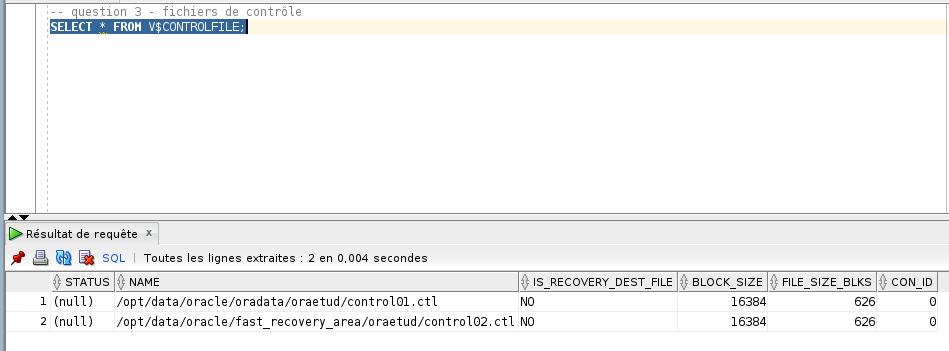

On trie la requête sur la table `V$DATABASE` avec les champs que l'on veut, donc on récupère le nom, puis la date de création du fichier et enfin le numéro du `SCN`.

```sql
SELECT NAME, CREATED, CHECKPOINT_CHANGE# FROM V$DATABASE;
```

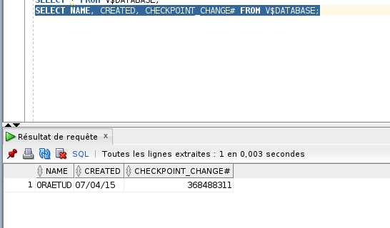

# Partie 3 - Mémoire

## Question 1

La taille de la "SGA" (System Global Area) se trouve dans la colonne `VALUE`, 1ère ligne de la table `V$SGAINFO`.

On trouve aussi cette valeur (ici 2927384 B) dans la colonne `BYTES` de la table `V$SGA`.

On remarque aussi la colonne `RESIZEABLE`, qui veut dire redimensionnable en français et signifie si les zones qui composent la SGA sont ou ne sont pas allouées dynamiquement.
Si elles le sont, ce sera marqué `YES`, sinon `NO`.

```sql
SELECT * FROM V$SGAINFO;
```

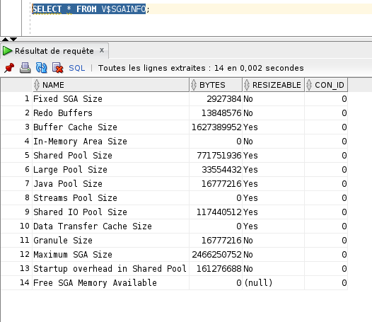

Nous n'obtenons aucune information de la requête suivante.

```sql
SELECT * FROM V$PARAMETER;
```

<!-- 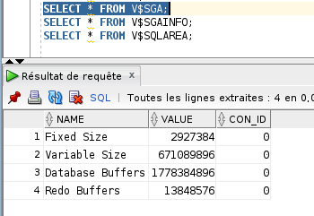 -->

## Question 2

La zone LC de la shared pool se trouve dans la table `V$SGASTAT`, dans la colonne `POOL`.

```sql
SELECT * FROM V$SGASTAT;
```

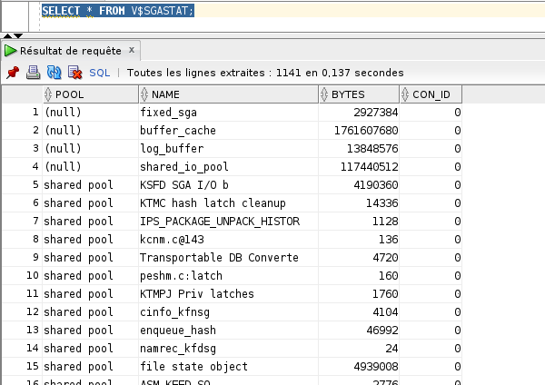


# Partie 4 - Processus

L'ensemble des processus se trouvent dans la table `V$PROCESS`, et on retrouve leur `PID` dans la colonne de ce même nom.

```sql
SELECT * FROM V$PROCESS;
```

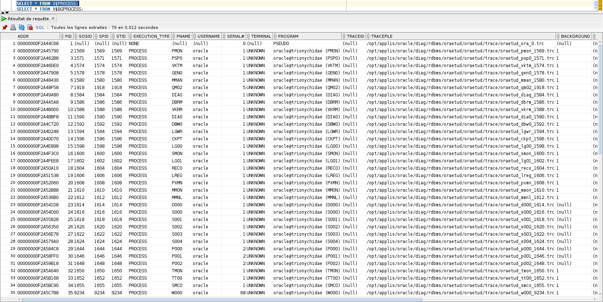

L'ensemble des processus en arrière-plan sont dans la table `V$BGPROCESS`. On retrouve leur nom dans la colonne `NAME`.

```sql
SELECT * FROM V$BGPROCESS;
```

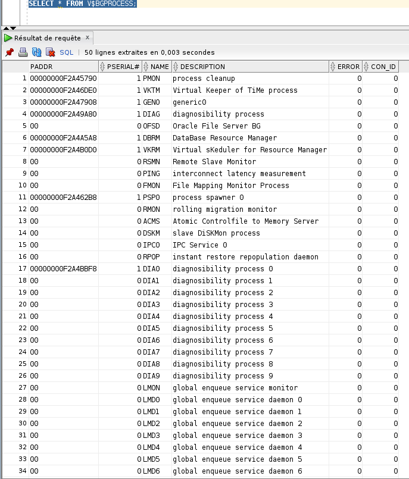
