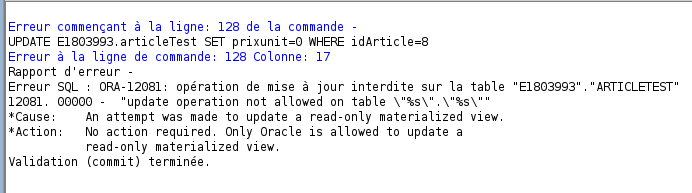

# Partie 1

Quel est le rôle qui vous est affecté ?

Cette requête nous permet de savoir dans quelle table chercher les rôles/privilèges attribués.

```sql
select * from dict where comments like '%role%';
```

On peut voir ci-dessous le role qui nous est attribué : 'UBS_AVANCE'
```sql
select granted_role from DBA_ROLE_PRIVS where grantee = upper('e1800010');
```

Voir pic 1


On peut voir ci-dessous le role de l utilisateur 'KESSLER_BDD': 'UBS_PROF'

```sql
select * from DBA_ROLE_PRIVS where grantee = upper('KESSLER_BDD');
```

Voir pic 2


L arbre des privilèges pour cet utilisateur est le suivant, car son rôle est 'UBS_PROF'.

```sql
select * from dba_sys_privs where grantee='UBS_PROF';
```

Voir pic 3


# Partie 2 

## Question 1

Création de la table 'articleTest', puis insertion des valeurs suivantes et validation.

```sql
DROP TABLE articleTest ;
CREATE TABLE articleTest
(
idarticle 	NUMBER,
designation 	VARCHAR2 (20),
prixunit 	NUMBER (7,2),
qtestock 	NUMBER  DEFAULT 0,
CONSTRAINT pk_articleTest PRIMARY KEY (idarticle)
) ;
INSERT INTO articleTest
        VALUES (1, 'classeur', 15.7, 100) ;
INSERT INTO articleTest
        VALUES (2, 'cahier', 4.55, 250) ;
INSERT INTO articleTest
        VALUES (3, 'stylo', 22.7, 300) ;
INSERT INTO articleTest
        VALUES (4, 'chemise', 3.75, 200) ;
INSERT INTO articleTest
        VALUES (5, 'crayon', 7.8, 1000) ;
COMMIT;
```

Effectuez une série de mises à jour sur votre table articleTest (INSERT, DELETE, UPDATE) :

```sql
INSERT INTO articleTest VALUES (6, 'ciseaux', 10.5, 200) ;
DELETE FROM articleTest WHERE idArticle=1 ;
UPDATE articleTest SET prixunit=prixunit*2 WHERE idArticle=2 ;
```

Voir pic 4


On visualise ce qu on vient d inserer de modifer, puis on annule cette mise à jour avec un 'ROLLBACK' et on peut revisualer cette annulation ensuite.

```sql
select * from articleTest;
ROLLBACK;
select * from articleTest;
```

Voir pic 5


## Question 2

Je donne les droits suivant à l utilisateur e1803993: 

```sql
GRANT SELECT, INSERT, UPDATE, DELETE ON articleTest TO E1803993;
```

Output:

```sql
-- succès de l'élément Grant.
```

Insertion de tuple dans la table E1803993 :

```sql
select * from E1803993.articleTest;
INSERT INTO E1803993.articleTest VALUES (6, 'ciseau', 10.5, 200);
INSERT INTO E1803993.articleTest VALUES (7, 'couteau', 10.5, 200);
COMMIT;
-- sans faire de commit, l'utilisateur ne verras pas l'ajout que j'ai fais
```

Je regarde ce que l autre utilisateur à rajouté dans ma table :

```sql
select * from articleTest;
```
Le tuple 'fourchette' à été ajouté après que l utilisateur ait fait une validation (COMMMIT).

J insère un tuple dans la table articleTest de E1803993. E803993 se positionne en mode READ ONLY.

```sql
INSERT INTO E1803993.articleTest VALUES (8, 'cuillère', 10.5, 200);
-- 1 ligne inséréé
select * from E1803993.articleTest;
-- la ligne est bien inséré de mon côté
-- e1803993 se met en read only avec la commande suivante (que je n'exécute pas) :
-- ALTER TABLE E1803993.articleTest READ ONLY;
-- et elle peut voir l'insertion que j'ai faite sans que j'ai eu besoin de faire de COMMIT
```

Le faite de s'être mis en mode READ ONLY lui permet de voir les modification que j ai faites, et si je fait un COMMIT, celà annule son mode READ ONYL.

Après validation de la transaction :

```sql
COMMIT;
select * from E1803993.articleTest;
-- je ne vois aucun changement, le tuple inséré juste avant est présent
-- rien ne change du côté de e&803993, car le commit à validé l'insertion faite avant.
```

Note: il se peut que Oracle bug, celà arrive assez souvent d ailleurs.

### Pose de verrou implicite

Je modifie un tuple de la 
```sql
UPDATE E1803993.articleTest SET prixunit=0 WHERE idArticle=8;
COMMIT; -- on sort du mode read only
-- impossible d'update la table de e1803993, nous n'avons pas les droits
-- oracle nous dit que seul Oracle peut modifier les les tables qui sont en read only, pourtant nous ne sommes pas en read only
```

Voir pic 6 



C est une erreur normale, et si e1803993 essaie de faire la même chose, elle a la même erreur, c est normal.

```sql
UPDATE E1803993.articleTest SET prixunit=0 WHERE idArticle=5;
```

Même erreur, c est normal.

### Pose de verrou explicite

Je verrouille ma table :

```sql
LOCK TABLE articleTest IN EXCLUSIVE MODE;
-- Succès de l'élément Lock.
```

Je modifie ma table :

```sql
UPDATE articleTest SET prixunit=0 WHERE idArticle=2;
COMMIT;
select * from articleTest;
-- ma modification est bien présente
```

U2 fait une modification sur ma table, je peux la voir : 

```sql
select * from articleTest;
-- tuple 9 rajouté par e1803993
```

Si E1803993 essaie de Lock ma table, ça marche, même résultat que quand je l ai fait.

Note : Normalement e1803993 ne devrait pas pouvoir faire d insertion parce que ma table est lock, mais c est un problème venant d Oracle, nous n y pouvons rien.
Il aurait peut être fallut se déconnecter et se reconnecter, mais nous n avons pas le temps de le faire, ni la certitude que cette méthode que vous nous avez dites pourrais marcher.

On peut se verrouiller mutuellement les tables, mais nous y avons encore le droit d'accès (que ce soit en lecture ou en écriture).

### Interblocages

Comment pourrait-on résoudre une situation d'interblocage ?

Nous pouvons déjà définir ce qu'est une situation d'interblocage.
Ce genre de situation intervient lorsque deux processus tentent de modifier les mêmes données au même moment.
Le SGBD, ici Oracle, bloque ces processus.
Pour résoudre le problème, le sgbd utilise l'algorithme FIFO (First In First Out), qui signifie comme son nom l'indique que si 2 instructions sont lancées en même temps, c'est la 1ère lancée qui sera la première à être réalisé.
Il y aura donc un temps d'attente de l'autre instrtuction. Et comme pour tout autre type de requête, cela peut être annulé via un `ROLLBACK`. Et on peut aussi tuer (kill) le processus qui cause le blocage du sgbd.
